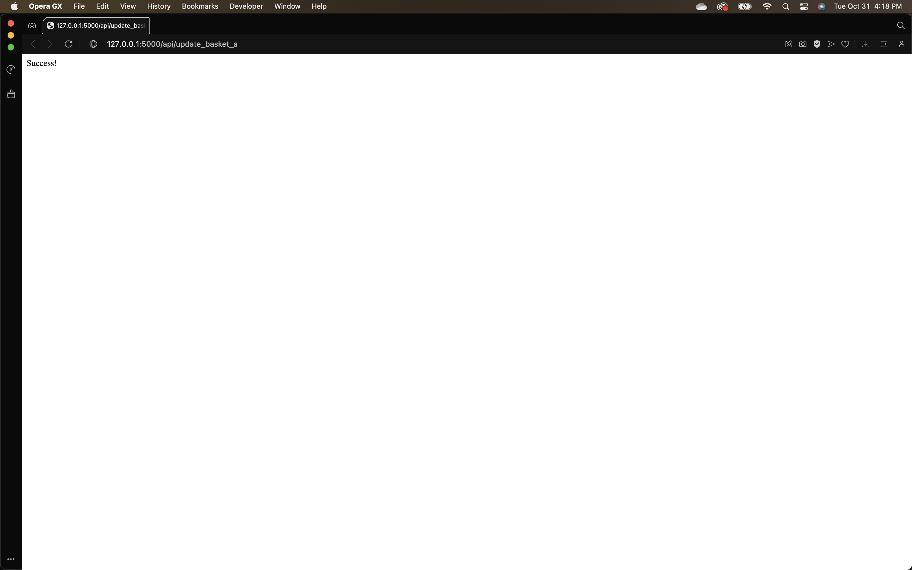
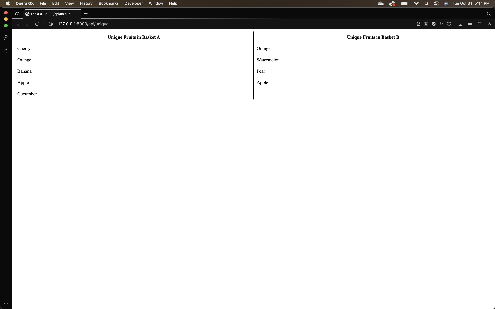

# HW3 README

## Team Members
- Team Member 1: [Zachary Cervenka] - [cervenkaz19@students.ecu.edu]


## Quick Start
### Local Test Setup
First, we need to install a Python 3 virtual environment with:
```
sudo apt-get install python3-venv
```

Create a virtual environment:
```
python3 -m venv python_venv
```

You need to activate the virtual environment when you want to use it:
```
source python_venv/bin/activate
```

To fufil all the requirements for the python server, you need to run:
```
pip3 install -r requirements.txt
```
Because we are now inside a virtual environment. We do not need sudo.

Then you can start the server with:
```
python3 main.py
```
### Once the application is running, you can access the following endpoints:

**Insert a New Row into basket_a:**

When you access http://127.0.0.1:5000/api/update_basket_a in your web browser, it will insert a new row with the value 'Cherry' into basket_a. You will receive either a "Success!" message or an error message from PostgreSQL.



**Display Unique Fruits:**

Access http://127.0.0.1:5000/api/unique in your web browser to retrieve and display unique fruits from both basket_a and basket_b in an HTML table format. If there are any errors from PostgreSQL, an error message will be displayed in the browser.

